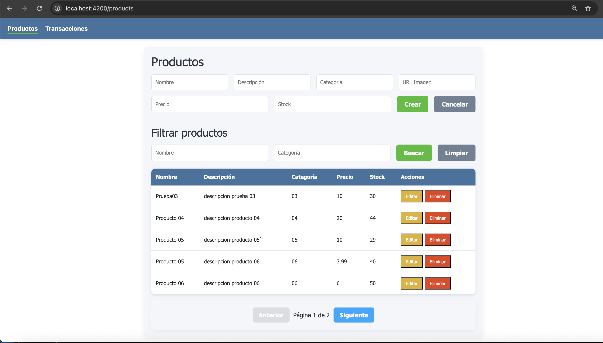

# Proyecto de Inventario

Este proyecto es un sistema de gestión de inventario que permite un CRUD de productos y transacciones, con funcionalidades de paginación y filtros dinámicos.

---

## Requisitos

Para ejecutar el proyecto en un entorno local, se necesitan los siguientes componentes:

- **Backend**:
  - .NET 9 SDK
  - SQL Server

- **Frontend**:
  - Node.js 22
  - npm 10
  - Angular CLI 19

---

## Creación de la base de datos SQL Server

1. Ejecutar en una base de datos SQL Server el archivo script.sql

---

## Ejecución del microservicio ProductsService

1. Clonar el repositorio:

```bash
git clone https://github.com/kjduy/InventoryApp
cd InventoryAppBackEnd
cd ProductsService
```

2.	Configurar el archivo en appsettings.json:

- Crear el archivo appsettings.json
- Tomar como ejemplo el archivo appsettings.example.json
- Colocar el host
- Colocar el puerto
- Colocar el nombre de la base de datos
- Colocar el usuario
- Colocar la contraseña
- Colocar el host y puerto en donde se ejecuta el frontend

3. Ejecutar el proyecto

```bash
dotnet run
```

4. Verificar funcionamiento

- Puede acceder a http://localhost:5226/swagger

---

## Ejecución del microservicio TransactionsService

1. Acceder a la carpeta del microservicio:

```bash
cd InventoryAppBackEnd
cd TransactionsService
```

2.	Configurar el archivo en appsettings.json:

- Crear el archivo appsettings.json
- Tomar como ejemplo el archivo appsettings.example.json
- Colocar el host
- Colocar el puerto
- Colocar el nombre de la base de datos
- Colocar el usuario
- Colocar la contraseña
- Colocar el host y puerto en donde se ejecuta el microservicio ProductsService
- Colocar el host y puerto en donde se ejecuta el frontend

3. Ejecutar el proyecto

```bash
dotnet run
```

4. Verificar funcionamiento

- Puede acceder a http://localhost:5255/swagger

---

## Ejecución del Front End

1. Acceder a la carpeta del front end

```bash
cd InventoryAppFrontEnd
```

2.	Instalar dependencias

```bash
npm install
```

3. Configurar el archivo enviroment

- Buscar el archivo enviroment.ts en la ruta src/environments
- Colocar las urls de los servicios del backend

4.	Ejecutar el servidor

```bash
ng serve
```

5. Verificar funcionamiento

- Puede acceder a http://localhost:4200

---

## Evidencias

- Listado dinámico de productos y transacciones con paginación.




- Pantalla para la creación de productos.


- Pantalla para la edición de productos.


- Pantalla para la creación de transacciones.


- Pantalla para la edición de transacciones.


- Pantalla de filtros dinámicos de productos y transacciones.


- Pantalla de validaciones de productos y transacciones.


